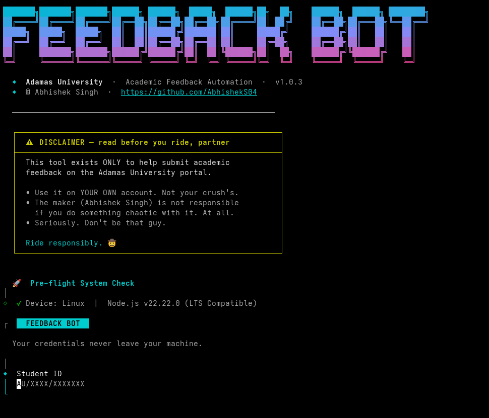

# 🚀 Adamas University Feedback Automator

Tired of clicking through pages just to submit your academic feedback? This tool does it all for you automatically in seconds!



> **⚠️ Quick Disclaimer:**
> Please use this only for your own account. Your ID and password are safe — they stay securely on your computer and are only used to log in directly to the university portal. No data is saved or shared.

---

## 🛠️ How to Use It

Don't worry if you've never used a terminal before! Just follow these two simple steps.

### Step 1: Install Node.js
Your computer needs a small background program called **Node.js** to run this tool. You can download it directly from their site, or be a pro and use a quick terminal command to install it.

**🪟 For Windows:**
* Download from the [Node.js Website](https://nodejs.org/) (Choose the "LTS" version).
* **Or** open PowerShell and paste this command:
  ```powershell
  winget install OpenJS.NodeJS.LTS
  ```

**🍎 For Mac:**
* Download from the [Node.js Website](https://nodejs.org/) (Choose the "LTS" version).
* **Or** open your Terminal and paste these commands:
  ```bash
  curl -o- https://raw.githubusercontent.com/nvm-sh/nvm/v0.40.3/install.sh | bash
  source ~/.zshrc
  nvm install --lts
  nvm use --lts
  ```

**🐧 For Linux:**
* Open your Terminal and paste these commands:
  ```bash
  curl -o- https://raw.githubusercontent.com/nvm-sh/nvm/v0.40.3/install.sh | bash
  source ~/.bashrc
  nvm install --lts
  nvm use --lts
  ```

---

### Step 2: Run the Bot
1. Open your computer's terminal:
   * **Windows:** Search for "Command Prompt" or "PowerShell" in your start menu.
   * **Mac/Linux:** Search for "Terminal".
2. Copy and paste the following command, then press **Enter**:

   ```bash
   npx feedback-au
   ```

3. If it asks you to install a package, just type `y` and press Enter.
4. The bot will start and ask for your Student ID and Password. *(Note: your password will be hidden as you type, but it's there!)*
5. Sit back and watch it complete all your pending subject feedbacks instantly! ✨

---

## ❓ What exactly does this do?
1. Opens a secure, invisible web browser.
2. Logs you into the Adamas Student Portal.
3. Automatically finds all the subject feedback forms you need to complete.
4. Fills them in with positive ratings and submits them for you.
5. Gives you a clean summary checklist when everything is done!

---

### 🔧 Having Trouble?
If you get an error saying something about "browsers" or "playwright", just copy and paste this command into your terminal and press Enter:
```bash
npx playwright install chromium
```
Once that finishes downloading, run `npx feedback-au` again!

<details>
<summary>📱 <b>For Android Users (Termux)</b></summary>

```bash
pkg update && pkg upgrade -y
pkg install nodejs-lts git -y
npx feedback-au
```
</details>
